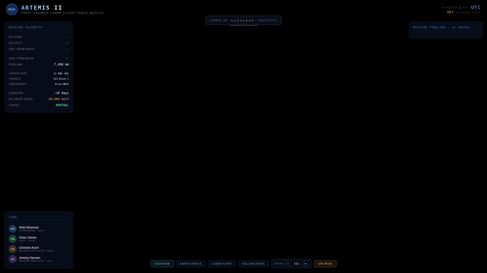

# Artemis II Mission Replay

An independent browser-based 3D visualization of the Artemis II mission profile.
It presents a simplified Earth–Moon trajectory, mission phases, spacecraft views
and accelerated replay controls using Three.js.

[Open the live replay](https://fremen.github.io/artemis-ii-mission-replay/)



## Features

- Interactive 3D Earth, Moon, launch vehicle and spacecraft visualization
- Fifteen selectable mission phases
- Overview, Earth-orbit, lunar-flyby and spacecraft-following cameras
- Adjustable replay speed and one-click restart
- Fully static deployment with no analytics, backend or user data collection
- Self-hosted Three.js dependency; no runtime CDN or font requests

## Run locally

```bash
cd artemis-ii-mission-replay
python3 -m http.server 8000
# open http://localhost:8000
```

## Accuracy and attribution

This is an illustrative educational visualization, not a source of operational
or navigational information. Trajectories, timings, distances and telemetry are
simplified for presentation and should not be treated as live or authoritative.

This project is independent and is not affiliated with or endorsed by NASA, the
Canadian Space Agency, or their contractors. NASA and Artemis names are used only
to identify the publicly documented mission being visualized. No NASA insignia or
agency branding is used.

## Technology

- HTML, CSS and JavaScript
- Three.js r128, distributed under the MIT License
- Static hosting through GitHub Pages

See [THIRD_PARTY_NOTICES.md](THIRD_PARTY_NOTICES.md) for dependency attribution.
Project code is released under the [MIT License](LICENSE).
